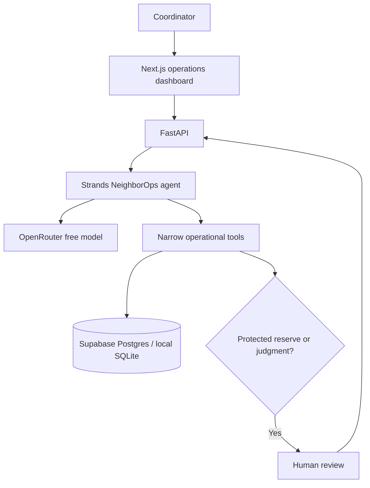

# NeighborOps AI

**Autonomous Resource Coordination for Community Organizations**
Agents for Humans · Good Neighbor Agents track

**Live demo:** [neighborops-ai.vercel.app](https://neighborops-ai.vercel.app/) · **API:** [neighborops-backend.vercel.app/api/health](https://neighborops-backend.vercel.app/api/health) · **Source:** [GitHub](https://github.com/kmt9967/neighborops-ai)

> Automate routine coordination. Escalate judgment.

Community pantries receive more help requests than small teams can manually classify, check, schedule, and follow up. NeighborOps AI handles the repetitive operations while staff retain authority over scarce-resource and fairness decisions. This is an operations dashboard, not a chatbot. The demo organization and all people are fictional.

## Demo workflow

The seeded Karachi Community Pantry has five new requests, three resource types, and three volunteers. Run Agent from the dashboard. With a configured OpenRouter key, a **real Strands agent** chooses tools to process each request. Three routine cases can be allocated, a missing-location case needs information, and a ten-box event request reaches the protected food reserve and requires a human decision. The operator can reduce it to four; inventory, tasks, and the activity timeline update. Free-model output can vary, but tool-level policy is enforced regardless of what the model says.

## Why an agent instead of a chatbot?

The operator does not have to ask a series of questions or manually move data between systems. Strands chooses which operational tools to invoke for each request, receives their actual results, and continues or escalates. The audit timeline shows what actually happened. A model's text alone cannot reserve inventory or change status.

## Architecture



**Stack:** Next.js 16, TypeScript, Tailwind CSS, lucide-react, FastAPI, SQLAlchemy, Strands Agents SDK, OpenRouter free models, and Supabase Postgres. Both web projects run on Vercel Hobby. SQLite allows a zero-account local demo. The backend uses Strands' OpenAI-compatible provider with the OpenRouter base URL; no AWS or local LLM is required.

## Agent tools

`get_pending_requests`, `get_request_details`, `classify_request`, `get_inventory`, `get_resource`, `check_safety_threshold`, `reserve_inventory`, `get_available_volunteers`, `match_volunteer`, `create_delivery_task`, `schedule_followup`, `draft_notification`, `request_human_approval`, `mark_needs_information`, and `complete_routine_processing` are actual Strands tools. The model has no unrestricted database tool. Reservations use a conditional update and unique allocation key, making retries safe against double reservation.

## Database

`organizations`, `requests`, `resources`, `volunteers`, `allocations`, `agent_runs`, `agent_events`, `human_decisions`, `tasks`, and `notifications`. The [Supabase migration](backend/sql/001_schema.sql) enables RLS without anonymous policies. The backend's [seed script](backend/seed.py) is idempotent. Local SQLite startup seeds an empty database; hosted Postgres is migrated and seeded separately.

## Local setup

Requires Node.js 20+ and Python 3.11+. Copy `.env.example` to `.env` at the repository root, set `OPENROUTER_API_KEY` to your own key, and keep it private. The backend loads that file automatically. Do not put the key in `NEXT_PUBLIC_*`.

Backend (from `backend/`):

```bash
python -m venv .venv
# Activate the virtual environment for your shell
pip install -r requirements.txt
uvicorn app.main:app --reload --port 8000
```

Frontend (from `frontend/`):

```bash
npm install
npm run dev
```

Open `http://localhost:3000`. The backend automatically creates and seeds `backend/neighborops.db` if `DATABASE_URL` is not set. `NEXT_PUBLIC_API_URL` defaults to `http://localhost:8000`.

### Environment variables

| Variable | Purpose |
|---|---|
| `OPENROUTER_API_KEY` | Backend-only model credential |
| `OPENROUTER_MODEL` | Primary free model; defaults to `nex-agi/nex-n2.5-pro:free` |
| `OPENROUTER_FALLBACK_MODEL` | Secondary free model; defaults to `openrouter/free` |
| `DATABASE_URL` | SQLite or direct Supabase Postgres connection string |
| `SUPABASE_URL` | Optional project identifier; current backend uses `DATABASE_URL` |
| `NEXT_PUBLIC_API_URL` | Browser-visible backend URL |
| `FRONTEND_ORIGINS` | Comma-separated CORS origins; defaults to local Next.js |

## Testing

```bash
cd backend && python -m pytest -q
cd ../frontend && npm run lint && npx tsc --noEmit && npm run build
```

Tests cover safe reservations, protected thresholds, missing information, unavailable volunteers, routine coordination, human reduction, idempotency, missing keys, audit events, and provider failure.

## Deployment

1. Apply [`001_schema.sql`](backend/sql/001_schema.sql) to a Supabase project, then run [`seed.py`](backend/seed.py) once. The production project uses the TLS session pooler with `sslmode=verify-full` and the bundled public CA. The service-role key is not required.
2. Import this repository into a Vercel Hobby project named `neighborops-backend` with `backend/` as root and FastAPI preset. Set backend-only `DATABASE_URL`, `OPENROUTER_API_KEY`, `OPENROUTER_MODEL`, `OPENROUTER_FALLBACK_MODEL`, and `FRONTEND_ORIGINS=https://neighborops-ai.vercel.app`. The [`vercel.json`](backend/vercel.json) allows a 300-second function run.
3. Import the same repository into a second Vercel Hobby project named `neighborops-ai` with `frontend/` as root and Next.js preset. Its only custom environment variable is `NEXT_PUBLIC_API_URL=https://neighborops-backend.vercel.app`.
4. Verify `/api/health`, CORS from the exact frontend origin, the five requests, the live agent run, and the human decision flow. The frontend invokes `/api/agent/run?limit=1` repeatedly so each request fits a serverless invocation.

## Limitations and future work

The current MVP uses explicit Run Agent initiation, synchronous processing, one fictional organization, and drafts notifications without sending them. Free model availability and tool reliability vary. The dashboard remains useful when the model is unavailable and never displays fabricated success. The public demo has unauthenticated mutating endpoints, so use fictional data only. Add operator authentication, organization isolation, background jobs, intake channels, policy configuration, and real notification delivery before using real beneficiary data.

### Hosted verification snapshot (September 13, 2026)

The deployed FastAPI health and dashboard endpoints returned HTTP 200; the Vercel frontend displayed the seeded Postgres data, and CORS allowed its exact origin. Real Strands/OpenRouter runs completed `REQ-001` and `REQ-002` using `openrouter/free`. Persisted tool events confirm classification, stock checks, two reservations totaling three food boxes, volunteer matching, and two tasks. Food stock moved from 18 available / 6 reserved to 15 available / 9 reserved. The other three requests remained `NEW` after the provider's free daily quota was exhausted, so the hosted human-review flow and final second-run idempotency check remain pending. Completed requests were not processed again during subsequent retries, and their two allocations stayed unique. The free quota resets at the provider's next daily window; no paid credits are required or configured.

## Hackathon disclosure

Built for the Agents for Humans hackathon. The demo data is entirely fictional. Strands performs actual model-driven tool invocation when a valid OpenRouter key is configured. No paid AWS, local model, or paid notification service is used.

See [architecture](docs/ARCHITECTURE.md), [agent design](docs/AGENT_DESIGN.md), [demo script](docs/DEMO_SCRIPT.md), [security](docs/SECURITY.md), and [submission checklist](docs/SUBMISSION_CHECKLIST.md).

MIT licensed. See [LICENSE](LICENSE).
