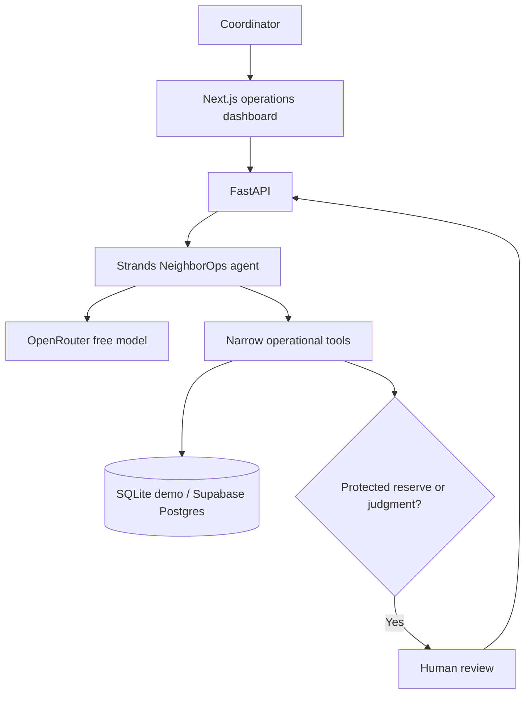

# NeighborOps AI

**Autonomous Resource Coordination for Community Organizations**
Agents for Humans · Good Neighbor Agents track

> Automate routine coordination. Escalate judgment.

Community pantries receive more help requests than small teams can manually classify, check, schedule, and follow up. NeighborOps AI handles the repetitive operations while staff retain authority over scarce-resource and fairness decisions. This is an operations dashboard, not a chatbot. The demo organization and all people are fictional.

## Demo workflow

The seeded Karachi Community Pantry has five new requests, three resource types, and three volunteers. Run Agent from the dashboard. With a configured OpenRouter key, a **real Strands agent** chooses tools to process each request. Three routine cases can be allocated, a missing-location case needs information, and a ten-box event request reaches the protected food reserve and requires a human decision. The operator can reduce it to four; inventory, tasks, and the activity timeline update. Free-model output can vary, but tool-level policy is enforced regardless of what the model says.

## Why an agent instead of a chatbot?

The operator does not have to ask a series of questions or manually move data between systems. Strands chooses which operational tools to invoke for each request, receives their actual results, and continues or escalates. The audit timeline shows what actually happened. A model's text alone cannot reserve inventory or change status.

## Architecture



**Stack:** Next.js 16, TypeScript, Tailwind CSS, lucide-react, FastAPI, SQLAlchemy, Strands Agents SDK, OpenRouter free models, and Supabase-compatible Postgres. SQLite allows a zero-account local demo. The backend uses Strands' OpenAI-compatible provider with the OpenRouter base URL; no AWS or local LLM is required.

## Agent tools

`get_pending_requests`, `get_request_details`, `classify_request`, `get_inventory`, `get_resource`, `check_safety_threshold`, `reserve_inventory`, `get_available_volunteers`, `match_volunteer`, `create_delivery_task`, `schedule_followup`, `draft_notification`, `request_human_approval`, `mark_needs_information`, and `complete_routine_processing` are actual Strands tools. The model has no unrestricted database tool. Reservations use a conditional update and unique allocation key, making retries safe against double reservation.

## Database

`organizations`, `requests`, `resources`, `volunteers`, `allocations`, `agent_runs`, `agent_events`, `human_decisions`, `tasks`, and `notifications`. The [Supabase migration](backend/sql/001_schema.sql) enables RLS without anonymous policies. The backend's [seed script](backend/seed.py) is idempotent; API startup also seeds an empty database.

## Local setup

Requires Node.js 20+ and Python 3.11+. Copy `.env.example` to `.env` at the repository root, set `OPENROUTER_API_KEY` to your own key, and keep it private. The backend loads that file automatically. Do not put the key in `NEXT_PUBLIC_*`.

Backend (from `backend/`):

```bash
python -m venv .venv
# Activate the virtual environment for your shell
pip install -r requirements.txt
uvicorn app.main:app --reload --port 8000
```

Frontend (from `frontend/`):

```bash
npm install
npm run dev
```

Open `http://localhost:3000`. The backend automatically creates and seeds `backend/neighborops.db` if `DATABASE_URL` is not set. `NEXT_PUBLIC_API_URL` defaults to `http://localhost:8000`.

### Environment variables

| Variable | Purpose |
|---|---|
| `OPENROUTER_API_KEY` | Backend-only model credential |
| `OPENROUTER_MODEL` | Primary free model; defaults to `nex-agi/nex-n2-pro:free` |
| `OPENROUTER_FALLBACK_MODEL` | Secondary free model; defaults to `openrouter/free` |
| `DATABASE_URL` | SQLite or direct Supabase Postgres connection string |
| `SUPABASE_URL`, `SUPABASE_ANON_KEY`, `SUPABASE_SERVICE_ROLE_KEY` | Reserved for optional Supabase integrations; current backend uses `DATABASE_URL` |
| `NEXT_PUBLIC_API_URL` | Browser-visible backend URL |
| `FRONTEND_ORIGINS` | Comma-separated CORS origins; defaults to local Next.js |

## Testing

```bash
cd backend && python -m pytest -q
cd ../frontend && npm run lint && npx tsc --noEmit && npm run build
```

Tests cover safe reservations, protected thresholds, missing information, unavailable volunteers, routine coordination, human reduction, idempotency, missing keys, audit events, and provider failure.

## Deployment

1. Run the SQL migration in a Supabase project and set a private **direct Postgres** `DATABASE_URL` on the Python host. The service-role key is not required by this implementation.
2. Deploy FastAPI with `uvicorn app.main:app --host 0.0.0.0 --port $PORT`, set `OPENROUTER_API_KEY`, and set `FRONTEND_ORIGINS` to the Vercel origin.
3. Deploy `frontend/` as the Vercel root directory. Set `NEXT_PUBLIC_API_URL` to the HTTPS backend URL and rebuild.
4. Verify `/api/health`, the five requests, the run, and the human decision flow before recording the demo.

## Limitations and future work

The current MVP uses explicit Run Agent initiation, synchronous processing, one fictional organization, and drafts notifications without sending them. Free model availability and tool reliability vary. The dashboard remains useful when the model is unavailable and never displays fabricated success. Add operator authentication, organization isolation, background jobs, intake channels, policy configuration, and real notification delivery before using real beneficiary data or exposing mutating endpoints publicly.

## Hackathon disclosure

Built for the Agents for Humans hackathon. The demo data is entirely fictional. Strands performs actual model-driven tool invocation when a valid OpenRouter key is configured. No paid AWS, local model, or paid notification service is used.

See [architecture](docs/ARCHITECTURE.md), [agent design](docs/AGENT_DESIGN.md), [demo script](docs/DEMO_SCRIPT.md), [security](docs/SECURITY.md), and [submission checklist](docs/SUBMISSION_CHECKLIST.md).

MIT licensed. See [LICENSE](LICENSE).
