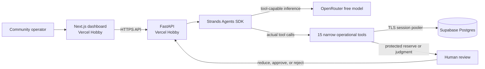

# Architecture

The [upload-ready PNG](architecture.png) shows the same architecture for Devpost. The deployed frontend is [neighborops-ai.vercel.app](https://neighborops-ai.vercel.app/), the API is [neighborops-backend.vercel.app](https://neighborops-backend.vercel.app/), and the database is a dedicated free Supabase project in Mumbai. The API allows the exact production frontend origin and local development origin through CORS.

FastAPI owns the operational state. Each `POST /api/agent/run?limit=1` invocation claims one `NEW` request atomically and starts a request-scoped Strands agent. The dashboard repeats the call until no new requests remain. This bounds each model run to one serverless invocation; the local API retains a five-request default. Strands chooses registered tools, and each mutating tool enforces policy in SQLAlchemy transactions. The unique allocation constraint and conditional inventory update prevent double reservation.

The SQL migration is applied separately to Supabase; a Vercel cold start does not attempt schema creation or seeding. SQLite still creates and seeds automatically for local development. The Supabase session-pooler connection verifies TLS against the bundled public CA. No database credential is sent to the browser. Human decisions enter through a separate API call and are recorded in the same activity timeline.

Current public demo limitation: mutating API endpoints have no operator authentication. The data is fictional. Add authentication, authorization, organization isolation, rate limits, and background jobs before handling real beneficiaries.
